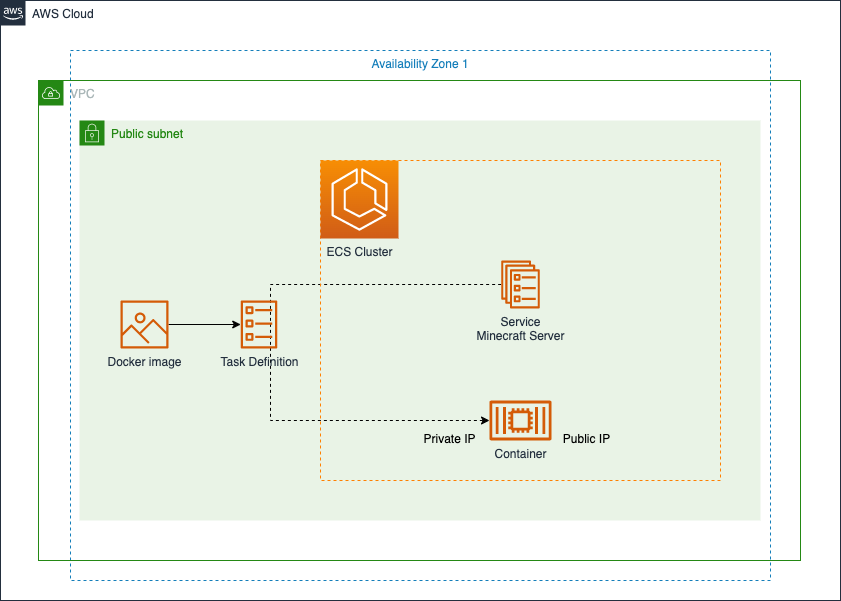

# Minecraft Server on AWS ECS Fargate usign Terraform



Host your own Minecraft Server on AWS ECS Fargate using Terraform

This Terraform main deploys a Minecraft server on AWS ECS using the Fargate launch type. The Minecraft server is deployed in a VPC with public subnets and a security group that allows incoming traffic on port 25565. The ECS task definition specifies the resources to be used by the Minecraft server, including CPU, memory, and the Docker image to run. The ECS service manages the deployment and scaling of the Minecraft server tasks.

## Requirements

- AWS CLI v2
- Terraform v0.13 or later.
- aws2-wrap to facilitate exporting the current AWS SSO credentials or runing a command with them
- An AWS account with sufficient permissions to create the resources defined in the Terraform main.

## Key Components

This Terraform module deploys the following components on AWS:

- VPC: A virtual private cloud (VPC) that provides isolated network space for the Minecraft server.
- ECS Cluster: An Amazon Elastic Container Service (ECS) cluster that manages the deployment and scaling of the Minecraft server.
- Security Group: A security group that controls access to the Minecraft server. The security group allows incoming traffic on port 25565.
- ECS Task Definition: An ECS task definition that specifies the resources to be used by the Minecraft server, including CPU, memory, and the Docker image to run.
- ECS Service: An ECS service that manages the deployment and scaling of the Minecraft server tasks.
- IAM Role: An AWS Identity and Access Management (IAM) role that provides permissions for the Minecraft server tasks to interact with other AWS services.
- IAM Role Policy Attachment: An IAM policy attachment that associates the IAM role with the necessary permissions.

These components work together to create a fully functional Minecraft server on AWS ECS using the Fargate launch type.

## Configuration

The Terraform `main.tf` can be configured by modifying the values in the following variables:

- region: The AWS region where the resources will be deployed.
- name: The name to be used for the VPC, ECS cluster, and other resources.
- cidr: The CIDR block to be used for the VPC.
- azs: The availability zones to be used for the VPC public subnets.
- public_subnets: The CIDR blocks to be used for the VPC public subnets.

## Usage

1. Clone this repository:

``` bash
git clone https://github.com/Yris-ops/Minecraft-Server-AWS-ECS-Fargate.git
cd Minecraft-Server-AWS-ECS-Fargate
```

2. Initialize Terraform and download the required providers:
``` bash
aws2-wrap --profile <aws_profile> terraform init
```

3. Create an execution plan:

``` bash
aws2-wrap --profile <aws_profile> terraform plan
```

4. Apply the Terraform configuration:

``` bash
aws2-wrap --profile <aws_profile> terraform apply
```

## Access Minecraft Server

1. Connect to the Minecraft server using the public IP address of the ECS task and port 25565.
	1. You can easily grab your new Minecraft Server endpoint navigating to the AWS ECS console.
	1. Navigate to the Tasks tab to see the `minecraft-server` task. Drill into the task to see the public IP and Enjoy.


## Customizing the Minecraft Server

The Minecraft server deployed by this Terraform is based on the itzg/minecraft-server:java17-alpine Docker image. This image provides a basic Minecraft server setup, but you may want to customize the server further to meet your needs.

For more information on customizing the Minecraft server, including options for changing the server properties, plugins, and mods, see the following repository: [itzg/docker-minecraft-server](https://github.com/itzg/docker-minecraft-server)

This repository provides a comprehensive guide on how to customize the Minecraft server, and includes examples for various use cases.

## Note

The Minecraft server version specified in the Terraform `main.tf` is 1.19.3. This version may become outdated over time, and you may need to update the version to the latest release. You can do this by modifying the `VERSION` environment variable in the `aws_ecs_task_definition` resource.

[DOWNLOAD THE MINECRAFT: JAVA EDITION SERVER](https://www.minecraft.net/en-us/download/server)

## Clean 

To remove the resources created by this Terraform `main.tf`, run the following command:

``` bash
aws2-wrap --profile <aws_profile> terraform destroy
```

## Security

See [CONTRIBUTING](CONTRIBUTING.md#security-issue-notifications) for more information.

## License

This library is licensed under the MIT-0 License. See the LICENSE file.